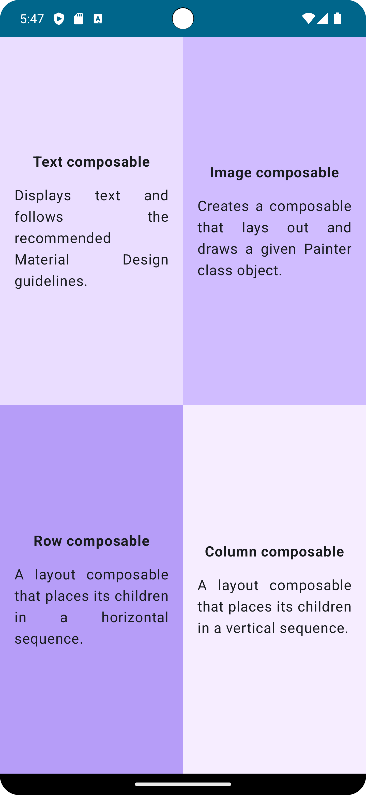

# Compose Quadrant App

A simple app that displays the information about the learned ```Composable``` functions using Jetpack Compose components like ```Column```, ```Row```, ```Box```, ```Text```, ```Image```, and ```Modifier```.

The screen is divided into four quadrants. Each quadrant provides the name of a ```Composable``` function and describes it in one sentence.

<p align="center">
  
</p>